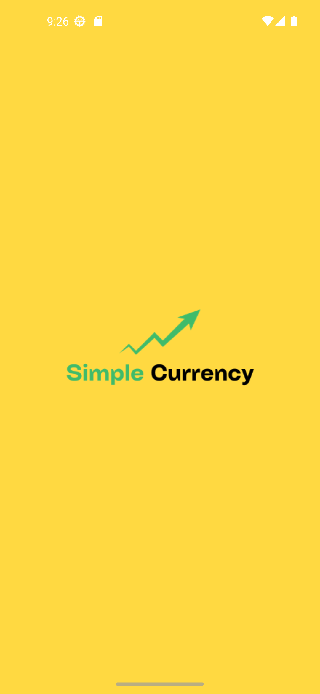

# SimpleCurrency

A currency exchange application using ExchangeRatesApi.
Objective: Understand interaction with API and Android APP, improve in kotlin coroutines and in UI.

Added a splash screen to improve UI and used Material 3 (Simple UI Design).

  
  
  

